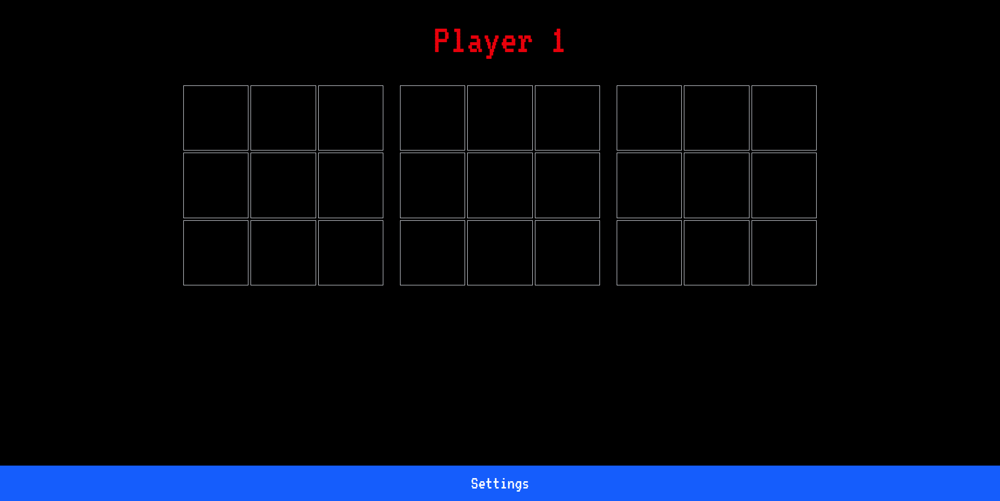

# Notakto

[![Contributors][contributors-shield]][contributors-url]
[![Forks][forks-shield]][forks-url]
[![Stargazers][stars-shield]][stars-url]
[![Issues][issues-shield]][issues-url]
[![Unlicense License][license-shield]][license-url]

## :question: What's Notakto?

**Notakto** is a [**misère and impartial form of tic-tac-toe**][1]. Also known as reverse tic-tac-toe, this variant turns the normal rules of tic-tac-toe on their head. It uses [misère rules][3], which means if you line up three marks in a row, you _lose_. And it's impartial, so both players use **X** and play on one to more grids, or boards. This turns tic-tac-toe into a **strategic zero-sum game**—like [**misère Nim**][2].

## :gear: Game Mechanics

In this implementation of notakto:

* You can play on one to five boards
* Boards can have between 2x2 and 5x5 cells
* The player that completes a row, a column, or the diagonal _loses_ that board.
* Boards with a complete row, column, or diagonal are inactivated—they become a "dead" board.

For example, to play a game with three 3x3 boards:

1. Player one puts an **X** in any position on any board.
1. Player two puts an **X** in any other position on any board.
1. Each player continues putting **X**s until they complete a row, a column, or the diagonal in a single board. That board is complete—players can't place any more **X**s there.
1. The players continue completing boards. _The player that completes the final board loses_.

 Watch the following animation to see an example game. In the final screen, Player 1 wins because Player 2 completes the final board.



## :video_game: Game Modes

You can play the game in three modes:

| Mode | Description |
|:-----|:------------|
| **Play vs Computer** | Play against AI with five difficulty levels. |
| **Play vs Player** | Play with a friend on the same device. |
| **Live Match** | Play against other in real-time matches over the internet. |

## :robot: AI Engine

This project's AI engine uses center-weighted heuristics and misère Nim strategies to play the game. You can scale the engine from easy (1) to hard (5). At lower difficulties, the engine introduces more randomness in its guesses.

## :sparkler: Coins and Power-ups

Get coins for each game you win. Use those coins to purchase power-ups, like **Undo Move** and **Skip Move** from the in-game **Settings** menu.

## :globe_with_meridians: Multiplayer (Live Match)

Play against others over the internet and climb the public leaderboard (coming soon!). Every win in the Live Match mode earns you XP. The more XP you earn, the higher your position on the leaderboard.

The game client uses [`Socket.IO`][10] to connect to a server. The server:

* Pairs players in matches
* Manages rooms that host both players
* Synchronizes moves from each player
* Disconnects each player from the room at the end of the game or when the player leaves.

## :package: Third-Party Packages

This project combines several third-party packages to add crucial features to the app:

* :floppy_disk: [Zustand][4] handles state management.
* :key: [Firebase Authentication][5] lets users sign in with their Google account.
* :lock: [Cloud Firestore][6] saves users' coins and XP.
* :money_with_wings: [Coinbase Commerce][7] accepts cryptocurrency payments so users can buy extra coins.

## :art: User interface and experience

The game client uses a retro 8-bit theme with nostalgic sound effects. And all features work seamlessly on both desktop and mobile browsers.

## :page_facing_up: Reference Documentation

See the [reference PowerPoint][8] to learn more about the project.

## :rocket: Planned Features

1. Global leaderboard (XP-based)
2. Friend list and “Play with Friends” mode
3. Ads integration with remove-ad purchase option
4. Crash analytics, logging, and user tracking
5. GitOps-style CI/CD to automatically deploy updates
6. Automated test scripts

## :handshake: Contributions

The notakto project welcomes all contributions!

If you have a question about the project or an idea on how to improve it, open an issue or create a pull request.

To create a pull request:

1. Fork the repository.
1. Create your feature branch in your forked repository.

    ```console
    git checkout -b feature/MyNewFeature
    ```

1. Commit your changes.

    ```console
    git commit -m 'Add my new feature'
    ```

1. Push to the branch.

    ```console
    git push -u origin feature/MyNewFeature
    ```

1. Open a pull request on this repository.

A reviewer reviews your pull request. If they approve the request, they merge your changes into the project's `main` branch.

## :balance_scale: License

This project is licensed under the MIT License. See [LICENSE][9] for more details.

## :telephone_receiver: Contact

To ask questions, offer suggestions, or provide feedback, [open an issue][11].

[1]: https://en.wikipedia.org/wiki/Tic-tac-toe_variants
[2]: https://www.hackerrank.com/challenges/misere-nim-1/problem
[3]: https://en.wikipedia.org/wiki/Mis%C3%A8re
[4]: https://github.com/pmndrs/zustand
[5]: https://firebase.google.com/docs/auth
[6]: https://firebase.google.com/products/firestore
[7]: https://www.coinbase.com/commerce
[8]: https://drive.google.com/file/d/1QHrSHDZumgNIxZhbl5kNWiP2y36SjO0U/view
[9]: ./LICENSE
[10]: https://socket.io/
[11]: https://github.com/Rakshitg600/notakto-website/issues/new

<!-- badge links -->
[contributors-shield]: https://img.shields.io/github/contributors/Rakshitg600/notakto-website.svg?style=for-the-badge
[contributors-url]: https://github.com/Rakshitg600/notakto-website/graphs/contributors
[forks-shield]: https://img.shields.io/github/forks/Rakshitg600/notakto-website.svg?style=for-the-badge
[forks-url]: https://github.com/Rakshitg600/notakto-website/network/members
[stars-shield]: https://img.shields.io/github/stars/Rakshitg600/notakto-website.svg?style=for-the-badge
[stars-url]: https://github.com/Rakshitg600/notakto-website/stargazers
[issues-shield]: https://img.shields.io/github/issues/Rakshitg600/notakto-website.svg?style=for-the-badge
[issues-url]: https://github.com/Rakshitg600/notakto-website/issues
[license-shield]: https://img.shields.io/github/license/Rakshitg600/notakto-website.svg?style=for-the-badge
[license-url]: https://github.com/Rakshitg600/notakto-website/blob/master/LICENSE
